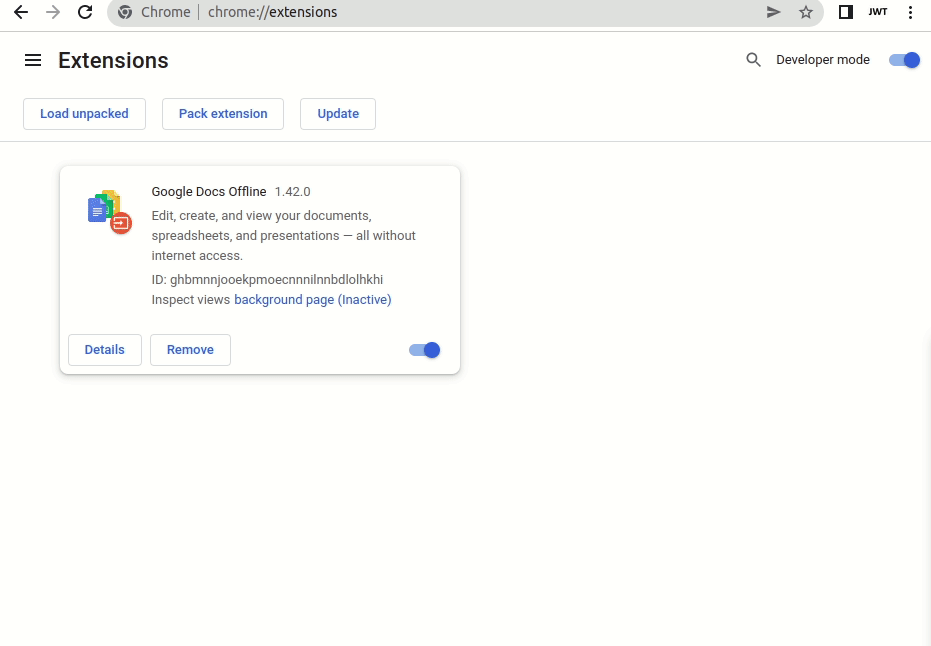

- uses `parcel@2.6.0` and `@parcel/config-webextension@2.6.0`
- [manifest.json] v2 has two entry points: [background.ts] and [popup.html]
- both entry points import something large (lodash)
- [package.json] users browserslist to target an old browser (Chrome 60)

This causes bundle splitting:

```sh
$ yarn && yarn build

dist/manifest.json                 261 B     47ms
dist/popup.ad5381fc.html           227 B    2.08s
dist/popup.8dfc8189.js             960 B    1.90s
dist/popup.be2dcf72.js         970.06 KB    2.03s
dist/popup.b32da9f1.js         972.16 KB    1.90s
dist/background.58f028a8.js        972 B    2.03s
```

Cannot find module error: 


[manifest.json]: manifest.json
[background.ts]: background.ts
[popup.html]: popup.html
[package.json]: package.json
